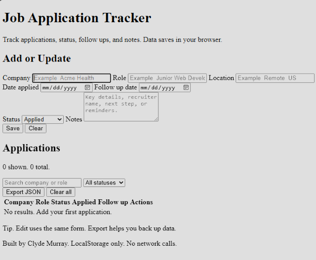

Live Demo
https://j0tracker.netlify.app

GitHub Repo
https://github.com/BANIMALS-NFT/Job-Tracker

Screenshot 

Job Application Tracker

What it is

A responsive web app to track job applications with status, follow up dates, and notes.  Data is stored locally in the browser using LocalStorage.

Features

CRUD for applications

Search by company or role

Filter by status

Export JSON backup

Responsive layout

Tech

HTML

CSS

JavaScript

LocalStorage

Run locally

Open index.html in a browser.

Optional.  Use VS Code Live Server for smoother testing.

Deploy

Netlify.  Drag and drop the folder, or connect GitHub repo.

Vercel.  Import the repo as a static site.

